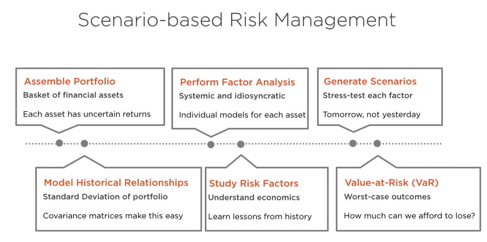

# Financial Risk Model

* Risk, uncertainty and Standard Deviation
* The role of covariance matrices
* Building Scenario-based stress tests
* Quantifying worst-case outcomes
* Implementing a risk modeling approach

## Factor-based Risk Models

* Portfolio - a basket of financial assets
* Asset - A stream of money comming in (or going out)
* Risk factor - A cause of uncertainty in the asset's cash flows:

```js
//  idiosyncratic risk Factors - Asset-specific
// Systemic risk Factors - Shared across assets
```

### Long Term Capital Management (LTCM)

Listen to the story of LTCM

### Covariance Matrix

a `matrix` that describe all of covariances in a `matrix`.


### Correlation 


## Techniques

### Scenario-based Risk Management

* Historical relationships - Learn from history, but don't repeat it
* Factor-based models - Identify underlying risk factor
* Scenario-based models - Stress-test each risk factor



* VaR - Value of Risk - The probability of losing something in the next trade.

## Implementing Financial Risk Model in Python

### Calculate portfolio of variance

Read more: [Here](https://medium.com/python-data/assessing-the-riskiness-of-a-portfolio-with-python-6444c727c474)