# Key Concept to learn

List of what to learn:

* Mean (Sum of value divided by total numbers of elements)
* Median (middle value of a distribution)
* Mode (Most prequently element that appears in distribution)
* Measure of dispersio
* Quantiles, Quatiles
* Skewness and Kurtosis
* Standard Variation

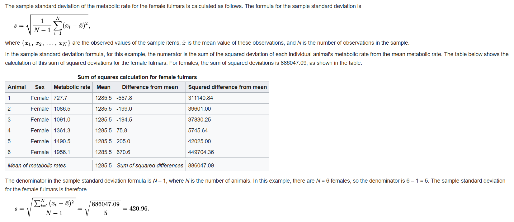

* Variance

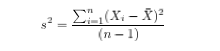

## Univariate Distribution Plot

* Histogram: A diagram that segment item into small chunks that can help to display distribution in groups

`Use cases`: Density Plot, Prequency Plot.

* Box Plot

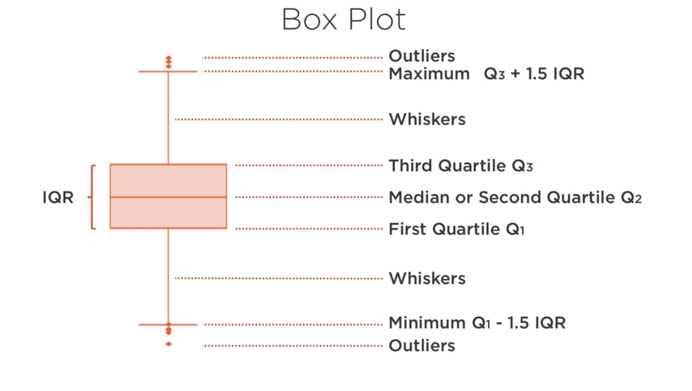

* Violin Plot

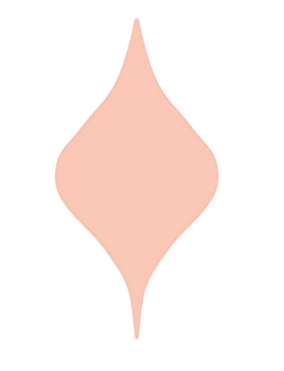

* Strip Plot

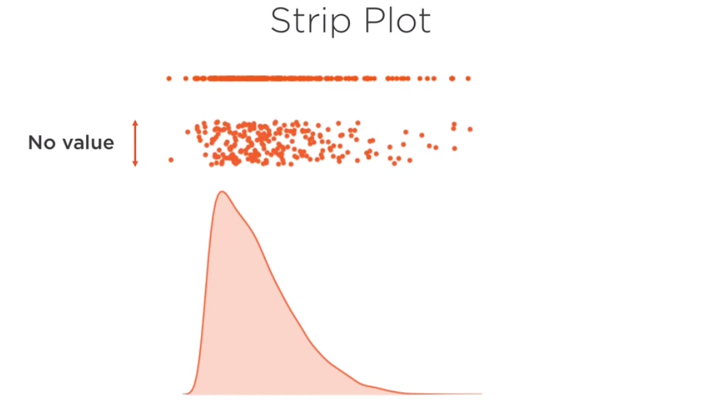

* Swarm Plot

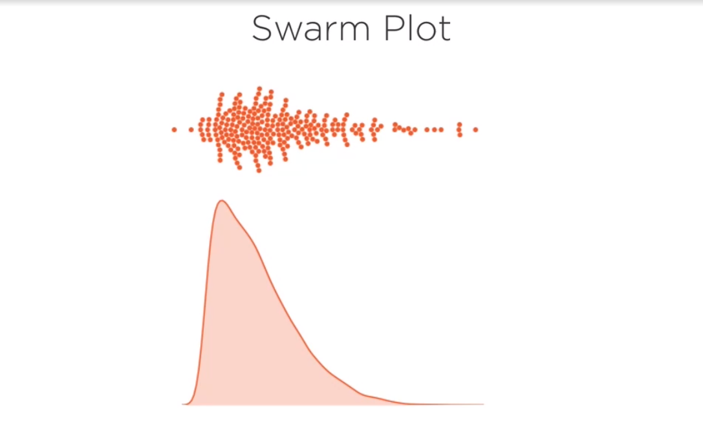

* Univariate Comparison Plot

`Bar Chart`, `Line Chart`, `Spark Line`, `Lag Plot`

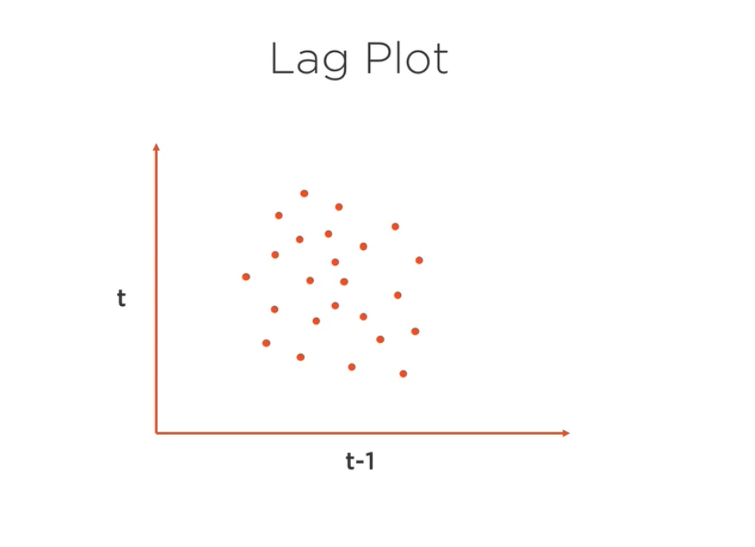

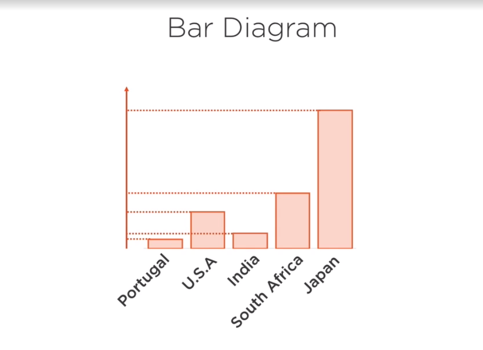

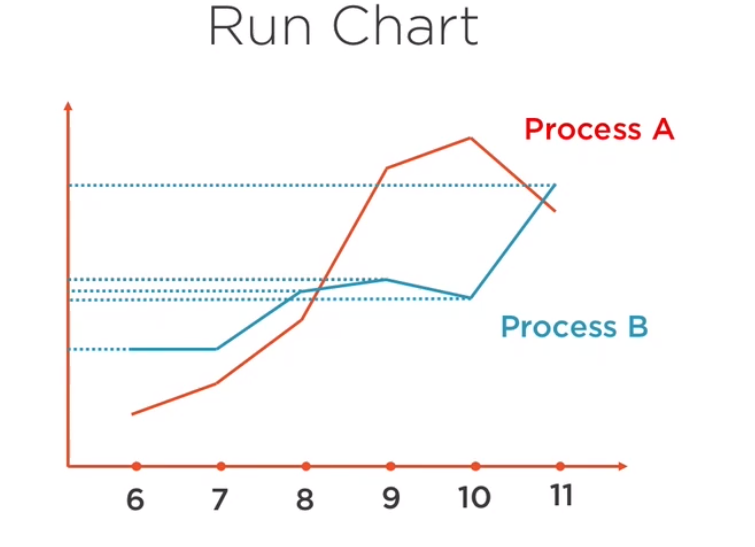

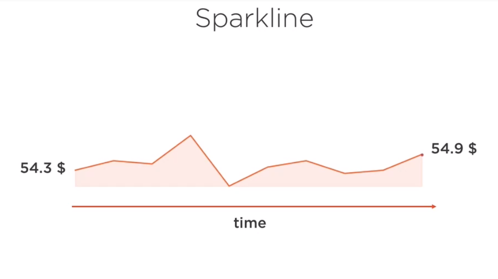

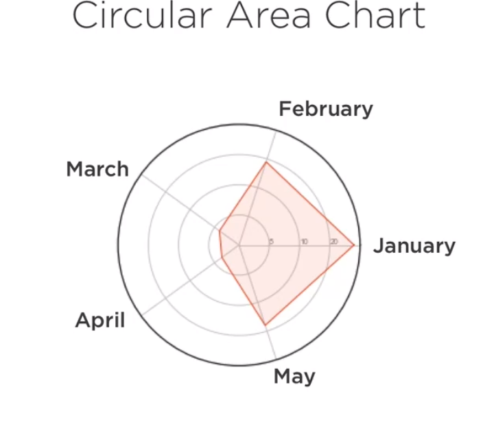

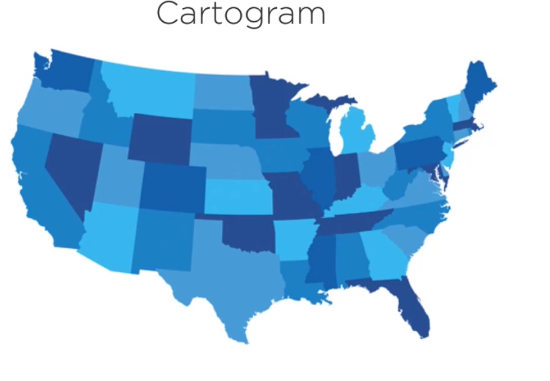

* Univariate Composition Plot

Key charts: `Pie Chart`, `Waffle Chart`, `Tree Map`, `Waterfall Chart`, ``

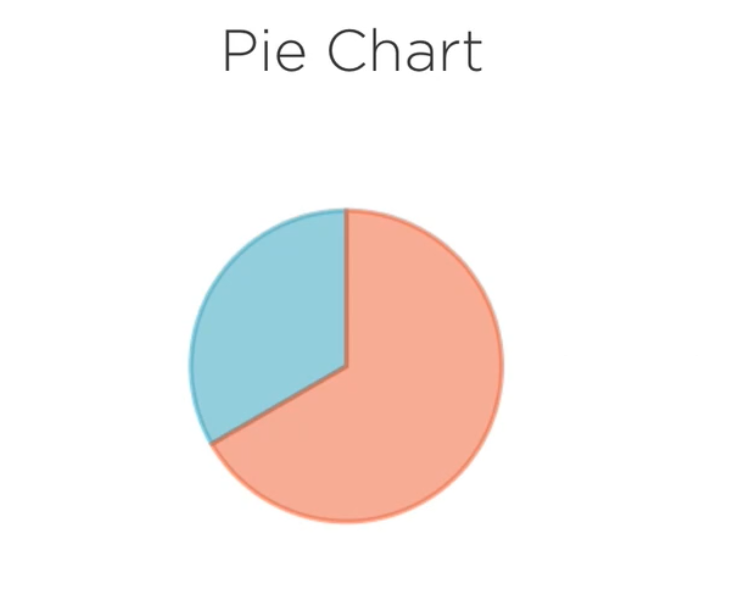

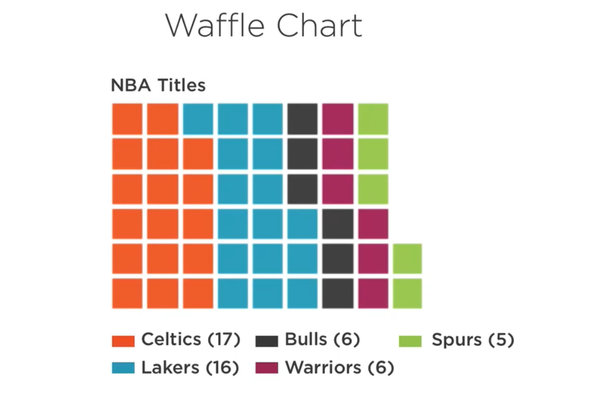

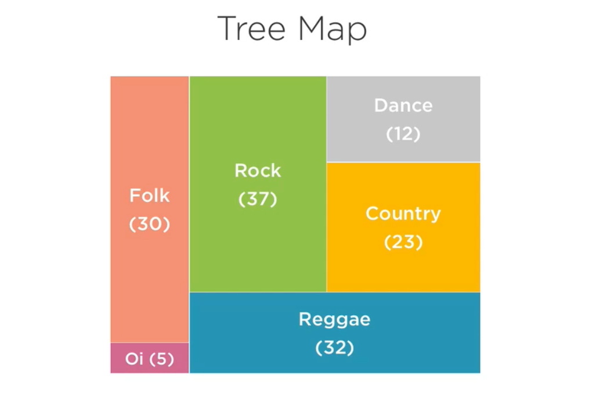

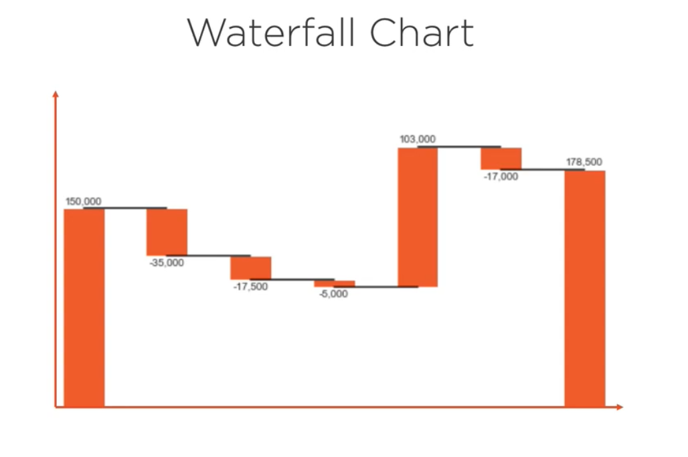

## Multivariable Plot

Goals of multivariable plot:

* Express relations by a statistical dependence.
* Charaterize dependence by a numerical cooficent.

Measurement of Covariance:

* Measure of joint probability of 2 random variables.
* Show tendency in a linear relationship (Whether it's negative or positive).
* Has units (Not easy to interpret strength of relationship).

Covariance Calculation:

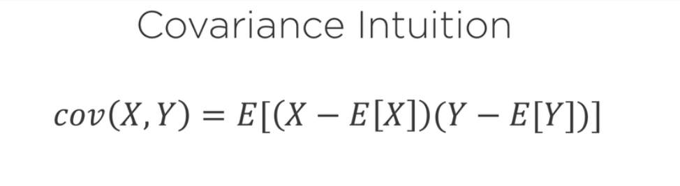
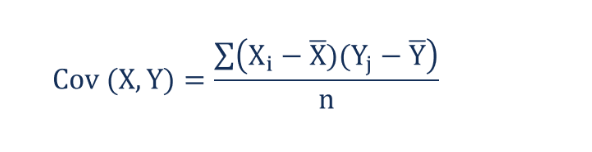

Correlation Calculation:

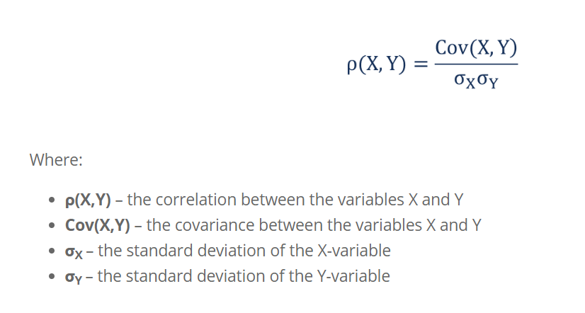

## PCA - Principle Component Analysis

* Eigenvector and Eigenvectors

See more: [Linear Algebra — Part 6: eigenvalues and eigenvectors](https://medium.com/sho-jp/linear-algebra-part-6-eigenvalues-and-eigenvectors-35365dc4365a)