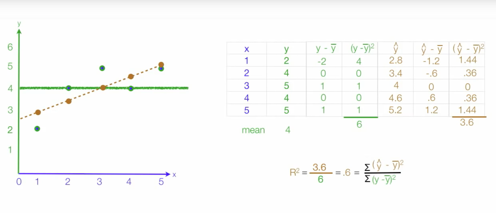
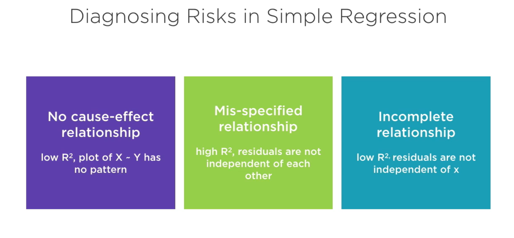

# Linear Regression

Important definition:

* Residuals

Assumptions about residuals:

* Variance
* Covariance
* Standard variation
* R-squared  = total explained variance / total variance

*Be aware of R-squared > 0.9*

More: [How to interpret R-squared](https://blog.minitab.com/blog/adventures-in-statistics-2/regression-analysis-how-do-i-interpret-r-squared-and-assess-the-goodness-of-fit)

## Diagnose Risk in Regression

