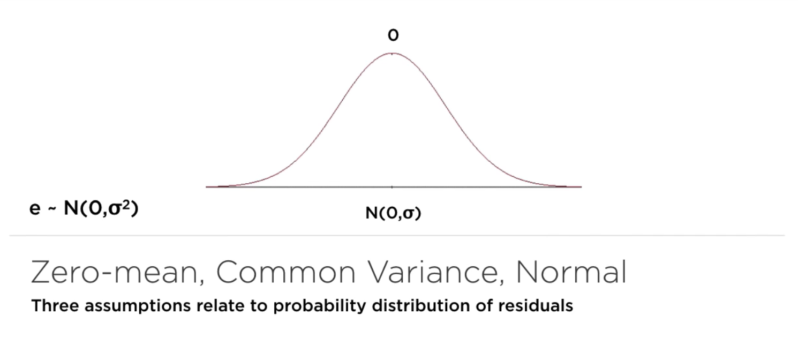

# Linear Regression

Important definition:

* Residuals

Assumptions about residuals:

* Variance
* Covariance
* Standard variation
* R-squared  = total explained variance / total variance

*Be aware of R-squared > 0.9*

## Diagnose Risk in Regression

