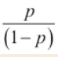

# Introduction to Linear Regression

`Logistic Regression` is a classification model that helps to solv problem of linear regression not converge during number of relatively large epouchs.

Advantages:

* Can be extended to multiclass classification

## Core concepts

### Odds ratio

