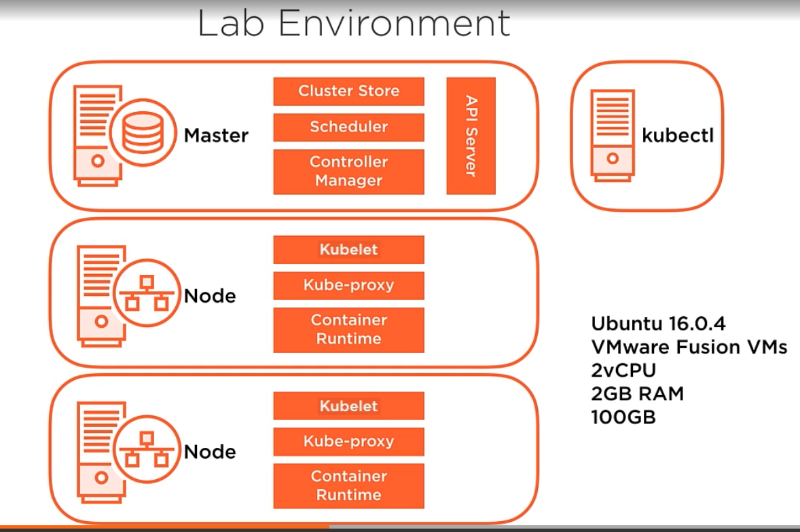

# Step to get started with K8s

## Reprequisites

* 2 Cores
* Disable Swap
* 2 GB RAM
* 100 GB Storage 

## Install K8s 

* Install Kubernetes on Virtual Machine (Do this on all nodes)

```bash
## Swap off
swapoff -a
vi /etc/fstab


## Add Google's apt repository gpg key
curl -s https://packages.cloud.google.com/apt/doc/apt-key.gpg | sudo apt-get add - 

## Add K8s to sources list
cat <<EOF >/etc/apt/sources.list.d/kubernetes.list
deb https://apt.kubernetes.io /kubernetes-xenial main
EOF 

## Update sources list of your machine
apt-get update

## Check proposed installment packages
apt-cache policy kubectl | head  -n 20
apt-cache policy kubeadm | head -n 20
apt-cache policy docker.io | head -n 20 

## Install kubeadm kubelet kubectl docker.io
apt-get install -y kubectl kubeadm kubelet docker.io
apt-mark hold kubectl kubeadm kubelet docker.io

## Checking current status of systemctl 
sudo systemctl service docker.service
sudo systemctl service kubelet.service

## If neither service is not active
sudo systemctl enable docker.service
sudo systemctl enable kubelet.service

## All config will be saved in /etc/kubernetes
ls /etc/kubernetes
```



* Boostrapping Cluster with Kubeadm

```bash

## Boostrapping Kubeadm
# Pre-flight check
# create CA
# generate config files and
# generate static Pod manifests
# Start control plan
# Taint the master
# Generate Boostrapping token
# Start Add-on pods DNS and kube-proxy
kubeadm init 
```

## Join a node into cluster

```bash
## ssh into the nodes
ssh aen@c1-node1

## Disable Swapp
swapoff -a
vi /etc/fstab

##  Add Gooogle's gpg key
curl -s https://packages.cloud.google.com/apt/doc/apt-key.gpg | sudo apt-get add - 

## Add K8s list of packages into source list
cat <<EOF >/etc/apt/sources.list.d/kubernetes.list
deb https://apt.kubernetes.io /kubernetes-xenial main
EOF 


## Update source list
apt-get update

## Install required packages
apt-get install -y docker.io kubectl kubelet kubeadm 
apt-mark hokd docker.io kubectl kubelet kubeadm

## Check service status
systemctl status docker.service
systemctl status kubelet.service

## On Master, get token list
kubeadm token list 
# or create new token
kubeadm create token

## On master, find CA hash
openssl x509 -pubkey -in /etc/kubernetes/pki/ca.crt | openssl rsa -pubin -outform der 2>/dev/null | openssl dgst -sha256 -hex | sed 's/^.* //'


```